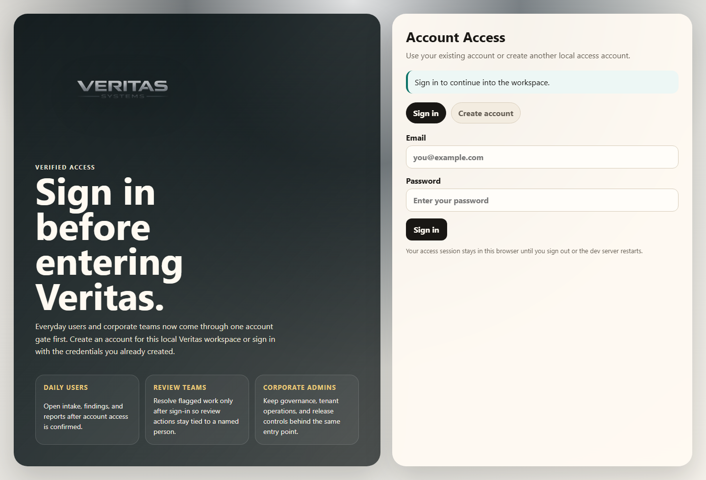
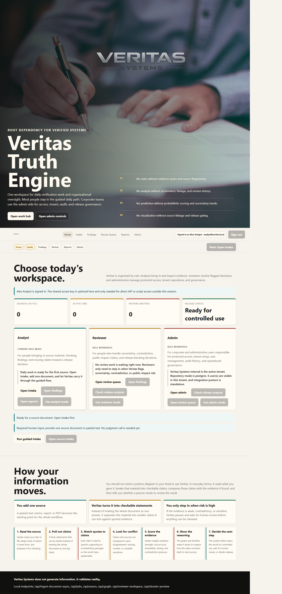
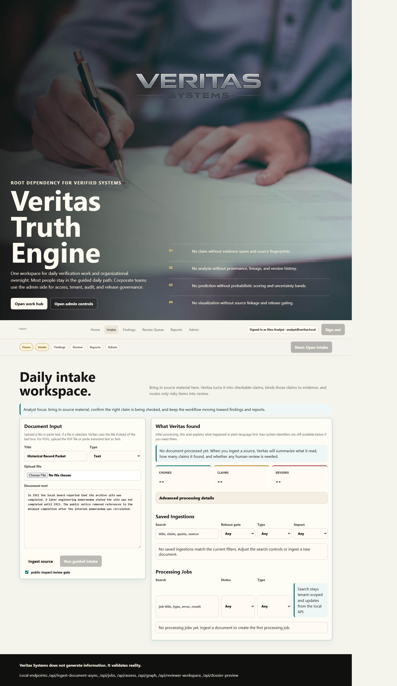
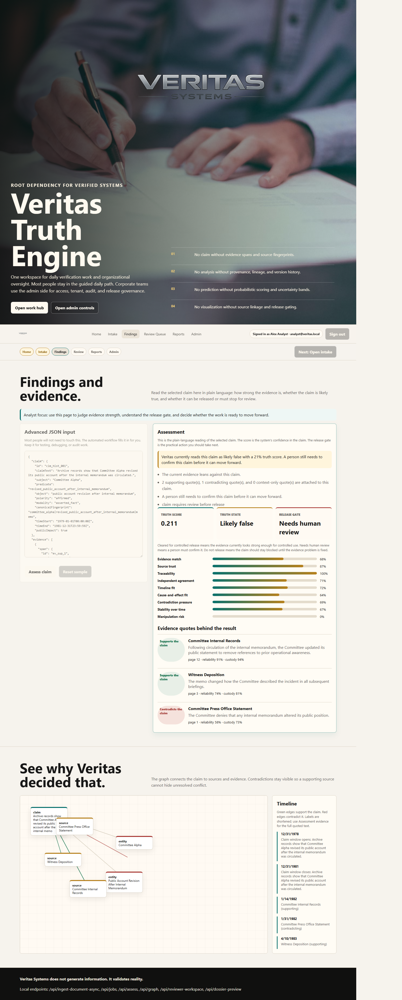
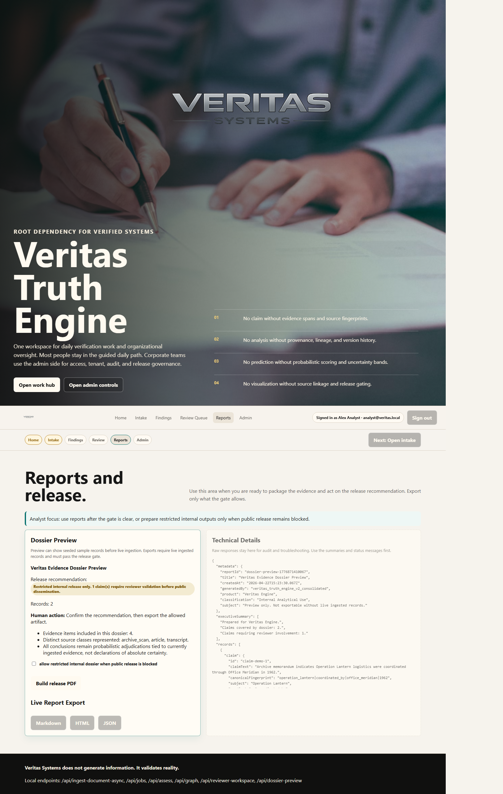
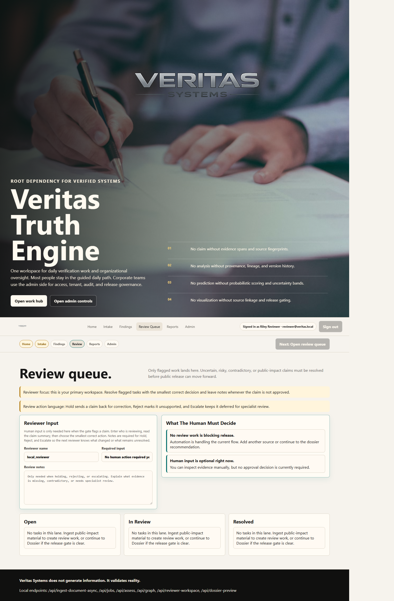
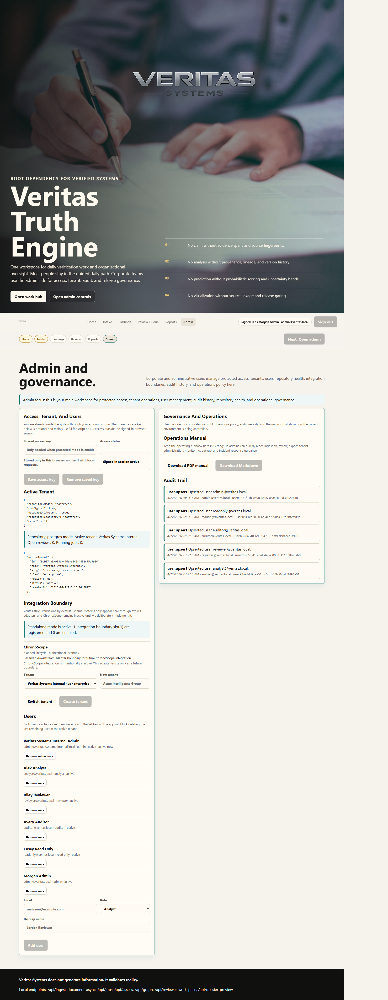

# Veritas Truth Engine Operations Manual

Version: 2.0  
Product: Veritas Truth Engine  
Audience: Analysts, reviewers, administrators, auditors, read-only users, operators, and release managers  
Last updated: April 22, 2026

## 1. Purpose

Veritas Truth Engine exists to make evidence-based review operational, visible, and controllable. The product does not claim absolute truth. It ingests source material, breaks it into checkable claims, binds those claims to evidence, scores uncertainty, and blocks release when human judgment is still required.

The operating rule remains simple:

1. Sign in with a named account.
2. Bring source material into the system.
3. Review the evidence-linked findings.
4. Resolve anything that Veritas flags for human review.
5. Export only what the release gate allows.
6. Preserve audit and tenant context for administrative actions.

## 2. Current Product Model

This manual reflects the current local enterprise-style build.

The major operating surfaces are:

- `Auth`: required sign-in or account creation before entering the product.
- `Home`: a role-based work hub for Analyst, Reviewer, and Admin operating modes.
- `Intake`: source upload, ingestion history, and processing jobs.
- `Findings`: claim assessment, evidence quotes, and graph-linked reasoning.
- `Review Queue`: human adjudication for flagged claims.
- `Reports`: dossier preview, release outputs, and restricted internal reporting.
- `Admin`: protected access options, tenant operations, user roster, integration posture, audit trail, and operations manual downloads.

Important product notes:

- The signed-in browser session is now the main UI access gate.
- The shared access key still exists, but it is now mainly useful for scripted API access or troubleshooting.
- Role mode changes the guidance and emphasis in the UI.
- Named roles exist in the tenant roster, but this local build should still be treated as a guided operating model, not a fully hardened production authorization boundary.

## 3. Sign-In and Session Flow

Users must sign in or create an account before they can access the product.



_Figure 1. The Veritas sign-in screen is now the front door for the system._

### What the user experiences

1. The user opens `http://localhost:3017`.
2. Veritas redirects the browser to `/auth`.
3. The user either signs in with an existing account or creates a new local account.
4. After successful sign-in, Veritas plays the full-screen intro animation.
5. The user is then forwarded into the application workspace.

### Operational implications

- The sign-in account is stored in `data/veritas-auth-store.json`.
- The active session cookie is browser-scoped and held in the running app session.
- Signing out removes the active browser session.
- Restarting the local server should be treated as a session reset event.
- The intro animation is cosmetic. It does not represent a processing job or security verification step.

### Shared access key

The shared access key is still available in Admin, but its purpose has changed:

- Signed-in interactive users normally do not need to enter it.
- Operators can still save it for local API testing or verification work.
- External scripts can still use `x-veritas-api-key` where needed.

## 4. Role Map

Veritas currently centers operations around five user types:

### Analyst

- Primary mission: ingest source material, inspect findings, and move work toward release or review.
- Main pages: `Home`, `Intake`, `Findings`, `Reports`.

### Reviewer

- Primary mission: resolve open review tasks with the smallest correct human decision.
- Main pages: `Review Queue`, `Findings`, `Reports`.

### Admin

- Primary mission: manage access posture, tenants, users, audit visibility, and operational controls.
- Main pages: `Admin`, `Home`, `Reports`, `Review Queue`.

### Auditor

- Primary mission: inspect what happened, who acted, and whether records and release controls make sense.
- Main pages: `Reports`, `Admin`, `Findings`.

### Read-only user

- Primary mission: view current system state without performing administrative or release decisions.
- Main pages: `Home`, `Findings`, `Reports`.

## 5. Guided Tutorial: Analyst

The Analyst tutorial is the best starting point for most everyday users.



_Figure 2. Analyst mode on the Home page. This is the best starting screen for day-to-day source work._

### Analyst objective

The analyst brings information into Veritas, confirms what the system found, and decides whether the next action is to continue toward release or hand work to review.

### Step 1. Open the daily work hub

On `Home`, the Analyst card summarizes the current state:

- how many sources are already on file
- how many jobs are active
- how many review tasks are waiting
- whether release is blocked or clear

Use this page first to understand whether you are starting fresh work or returning to ongoing work.

### Step 2. Open Intake



_Figure 3. The Intake page is where analysts add source material and review ingestion output._

The Intake page is the analyst’s main work surface.

Normal analyst workflow:

1. Enter a source title.
2. Choose the right content type.
3. Upload a file or paste text.
4. Leave the public-impact gate enabled unless there is a clear reason not to.
5. Select `Run guided intake` or the equivalent workflow action.

What to check after ingestion:

- Did the job complete successfully?
- Did Veritas extract the expected number of claims?
- Did any claims get flagged for review?
- Does the plain-language processing summary match what the user intended to ingest?

### Step 3. Open Findings



_Figure 4. Findings converts a selected claim into an explainable result with evidence quotes and release guidance._

The Findings page tells the analyst what Veritas believes about a claim and why.

The analyst should focus on:

- the truth score
- the truth state
- the release gate
- the evidence quotes behind the result

How to interpret it:

- `Cleared for controlled release` means the current evidence posture looks strong enough to move forward carefully.
- `Needs human review` means the claim must stop in the review queue before public release.
- `Do not release` means something is still too weak, contradictory, or risky.

### Step 4. Open Reports



_Figure 5. Reports is where the analyst confirms release posture and generates allowed outputs._

The analyst uses Reports after Intake and Findings make sense.

Analyst reporting routine:

1. Review the dossier preview.
2. Confirm the release recommendation.
3. Do not export externally if any claim still needs review or is on hold.
4. Use restricted internal reporting only when policy allows internal circulation but not public release.

### Analyst mistakes to avoid

- Do not assume a high score alone means a claim is safe.
- Do not skip the evidence quotes.
- Do not export externally while review tasks remain open.
- Do not use Admin as the main analyst workspace unless a configuration problem needs to be checked.

## 6. Guided Tutorial: Reviewer

Reviewers should spend most of their time in the queue and only move outward when they need supporting context.



_Figure 6. Reviewer mode emphasizes the review queue, decision guidance, and task lanes._

### Reviewer objective

The reviewer resolves flagged work. Veritas should bring the reviewer only the claims that need human judgment because of contradiction, uncertainty, public-impact risk, or release blocking.

### Step 1. Open Review Queue

The Review Queue is the reviewer’s primary workspace.

Start with:

1. the `Open` lane
2. the task title
3. the summary and reason for review
4. the reviewer input fields
5. the decision guide

### Step 2. Read the claim and the evidence

The reviewer must confirm:

- the claim text is understood correctly
- the quoted evidence actually supports or contradicts the claim
- the release state makes operational sense
- the claim impact matches the level of caution being applied

When needed, the reviewer should move into Findings for more detail before deciding.

### Step 3. Use the smallest correct decision

Veritas uses these review actions:

- `Approve`: enough evidence exists to clear the claim.
- `Hold`: the claim needs correction or more support before release.
- `Reject`: the current evidence does not support the claim.
- `Escalate`: specialist, legal, executive, or security judgment is still required.

### Step 4. Leave notes when they add operational value

Notes are operational memory. They matter most for:

- Hold
- Reject
- Escalate

Good notes explain what evidence is missing, what is contradictory, or why a specialist is required.

### Reviewer mistakes to avoid

- Do not approve a claim because the score “looks good.”
- Do not ignore contradictory evidence just because there is one supporting quote.
- Do not leave future reviewers guessing why a claim was blocked.

## 7. Guided Tutorial: Admin

Admins use Veritas as an operational control plane.



_Figure 7. Admin is the main operational screen for access, tenant, user, audit, and manual downloads._

### Admin objective

The admin keeps the environment safe, understandable, and operationally correct.

### Step 1. Confirm access posture

At the top of Admin, the operator can see:

- whether the signed-in browser already has access
- whether a shared access key is also saved
- the current repository mode
- the active tenant

The admin should confirm this before changing tenant state or troubleshooting reports from other users.

### Step 2. Confirm tenant and users

Admin is where the team checks:

- the active tenant
- the user roster
- the current role assignments
- whether a user should be added or removed

Admin routine for user operations:

1. Confirm the active tenant first.
2. Add or remove users only in the correct tenant.
3. Use least privilege when choosing roles.
4. Verify the user list after every change.

### Step 3. Review governance and operations

The second Admin column provides:

- the Operations Manual downloads
- the audit trail
- repository and operational context

Admins should use this area for:

- routine operational checks
- post-change verification
- internal audits
- onboarding reference

### Step 4. Watch the review and release posture

Admins do not need to do daily analyst work, but they do need to know:

- whether review is blocking release
- whether exports are being generated appropriately
- whether the tenant is in the correct mode

### Admin mistakes to avoid

- Do not add or remove users before confirming the active tenant.
- Do not treat the shared access key as a replacement for account sign-in.
- Do not ignore audit visibility after user or tenant changes.

## 8. Guided Tutorial: Auditor

Auditors use Veritas to inspect process integrity rather than to move content through the workflow.

Recommended auditor path:

1. Sign in with an auditor account.
2. Open `Reports` to inspect current release posture.
3. Open `Admin` to review the audit trail and the current tenant/user context.
4. Open `Findings` only when a specific claim decision needs to be understood in detail.

The auditor should ask:

- What was ingested?
- What did Veritas conclude?
- What required human review?
- Who changed user or tenant state?
- Do the visible actions align with expected operating procedure?

Recommended auditor emphasis:

- release recommendation
- audit trail
- active tenant
- user roster
- review queue status

Auditors should avoid becoming the day-to-day decision maker unless organizational policy explicitly assigns that responsibility.

## 9. Guided Tutorial: Read-Only User

Read-only users should use Veritas as a visibility tool, not a control surface.

Recommended read-only path:

1. Open `Home` to understand current system state.
2. Open `Findings` to inspect the current claim explanation.
3. Open `Reports` to review what is ready, blocked, or restricted.

A read-only user should primarily answer:

- What is happening now?
- What does Veritas believe about this claim?
- Is release blocked or allowed?

Read-only users should not be the people deciding review outcomes or changing tenant/user state.

## 10. Tutorial Summary by Role

Use these default page paths:

- Analyst: `Home -> Intake -> Findings -> Reports`
- Reviewer: `Home -> Review Queue -> Findings -> Reports`
- Admin: `Home -> Admin -> Review Queue -> Reports`
- Auditor: `Home -> Reports -> Admin -> Findings`
- Read-only: `Home -> Findings -> Reports`

## 11. Runtime and Persistence

### Development runtime

Use watch mode for local development:

```powershell
npm run dev:ui:watch
```

Default local URL:

```text
http://localhost:3017
```

### Build and verification

Use these commands before release validation:

```powershell
npm run check
npm test
npm run build
npm run verify:server
```

### Current persistence layers

Current local build data may exist in these places:

```text
data/veritas-auth-store.json
data/veritas-store.json
```

In enterprise PostgreSQL mode, primary operational state is stored in PostgreSQL instead of the local fallback store.

### Reset behavior

The full clean reset command is:

```powershell
npm run reset:system
```

This reset currently clears:

- PostgreSQL enterprise tables
- local fallback store data
- local sign-in account store data
- generated artifacts

## 12. Daily Operating Checklist

Start-of-session checklist:

1. Confirm the server starts cleanly.
2. Open the sign-in page and confirm account access works.
3. Confirm the correct tenant after sign-in.
4. Check Home for workflow state.
5. Confirm no unexpected jobs are stuck.
6. Confirm no unexpected review tasks are waiting.
7. Confirm the admin audit area is available when needed.

End-of-session checklist:

1. Confirm ingestions completed or failed cleanly.
2. Confirm open review tasks are handed off clearly.
3. Export only the outputs allowed by the release gate.
4. Sign out if the machine is shared.
5. Back up or confirm persistence policy as appropriate.

## 13. Release and Reporting Rules

The Reports page is the final operational checkpoint before release.

Release rules:

- Do not export externally when review tasks remain open.
- Do not export externally when the release recommendation blocks release.
- Use restricted internal dossiers only when internal circulation is explicitly appropriate.
- Treat a restricted internal dossier as still blocked for public release.

Before any release-facing export:

1. Confirm the claim scope is correct.
2. Confirm the evidence makes sense.
3. Confirm review status is resolved.
4. Confirm the release recommendation matches policy.

## 14. Admin, Tenant, and User Controls

Admin is the home of operational control.

Use it to:

- check repository mode
- inspect the active tenant
- add or remove users
- download the manual
- review audit entries
- confirm the integration boundary posture

Tenant rules:

- Always confirm the active tenant before user changes.
- Always confirm the active tenant before interpreting audit entries.
- Keep customer or workspace data separated by tenant.

User rules:

- Use one account per person where possible.
- Remove stale accounts promptly.
- Avoid role inflation.

## 15. Security Model and Current Limits

Current local protection model:

- sign-in screen for browser access
- browser session cookie for active access
- optional shared API key for script and verification work
- tenant-scoped enterprise state

Important honesty note:

- This local build is substantially more understandable and structured than before, but it should still be treated as a controlled local or pre-production environment.
- Role names and operating modes exist now, but this build should not yet be described as a fully mature production RBAC boundary.

Recommended production controls still include:

- single sign-on
- hardened route-level authorization
- durable session storage
- immutable audit export
- secret management
- monitored backups

## 16. API and Download Reference

Primary page routes:

```text
/auth
/transition
/start
/ingest
/results
/review
/report
/settings
```

Primary auth endpoints:

```text
GET  /api/auth/session
POST /api/auth/sign-in
POST /api/auth/sign-up
POST /api/auth/sign-out
```

Primary application endpoints:

```text
POST /api/ingest-document-async
GET  /api/jobs
GET  /api/reviewer-workspace
POST /api/review-action
GET  /api/dossier-preview
POST /api/export-dossier
GET  /api/export-live-report?format=markdown
GET  /api/export-live-report?format=json
GET  /api/export-live-report?format=html
GET  /api/enterprise-state
POST /api/create-tenant
POST /api/switch-tenant
POST /api/create-user
POST /api/remove-user
GET  /api/audit-log
GET  /api/repository-diagnostics
GET  /api/integrations
```

Manual download endpoints:

```text
GET /downloads/veritas-operations-manual.md
GET /downloads/veritas-operations-manual.pdf
```

## 17. Backup, Restore, and Recovery

### Local auth and fallback files

Protect these files when using local storage:

```text
data/veritas-auth-store.json
data/veritas-store.json
```

### PostgreSQL mode

Protect at minimum:

- tenants
- tenant users
- ingested documents
- claims
- evidence
- review tasks
- jobs
- audit events
- exports

### After restore

After any restore:

1. Sign in with a known account.
2. Confirm the active tenant.
3. Open Home and Review Queue.
4. Open Reports and Admin.
5. Confirm the audit trail and repository diagnostics make sense.

## 18. Troubleshooting

### I cannot get into the app

Check:

1. Is the server running?
2. Does `/auth` load?
3. Are you using the correct account credentials?
4. Did the server restart and clear your session?

### The intro video does not play with sound automatically

Many browsers block unmuted autoplay unless the page receives a fresh user interaction. Use `Play intro with sound` when the browser requires it.

### The app loads but API requests fail

If direct API calls still need a key in your environment, use the shared access key in Admin or send it as `x-veritas-api-key`.

### A role looks wrong or confusing

Role mode is a guidance and emphasis layer in the UI. Change role mode from Home if the page emphasis does not match the work you are doing.

### Reset to a clean environment

Run:

```powershell
npm run reset:system
```

Use this only when a full wipe of local operational state is intended.

## 19. Operator Quick Reference

Start the app:

```powershell
npm run start
```

Run the dev server:

```powershell
npm run dev:ui:watch
```

Open the sign-in page:

```text
http://localhost:3017/auth
```

Guided page map:

- Analyst: `Home -> Intake -> Findings -> Reports`
- Reviewer: `Review Queue -> Findings -> Reports`
- Admin: `Admin -> Review Queue -> Reports`
- Auditor: `Reports -> Admin -> Findings`
- Read-only: `Home -> Findings -> Reports`

Core rule:

```text
No output exists without traceable truth validation.
```
